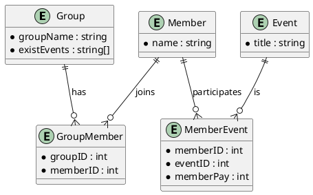
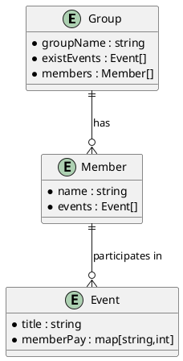

### 架構說明

只有一個database ： `payManagerLineBot`

每一個collection是一個機器人, 一個group

每一個collection中含有一個docs，其中有一個array，儲存了現存在的event

每一個group中，每一個user有一個docs，其中有一個Event array，代表此user參與的event

每一個Event物件中，有一個該event的名稱，與一個 string ： int 的 map，表此event中每一個user與此user的金額關係（欠/被欠 多少錢）


### 元件結構



### 待思考
```
-- 記錄個人支出記錄

```
